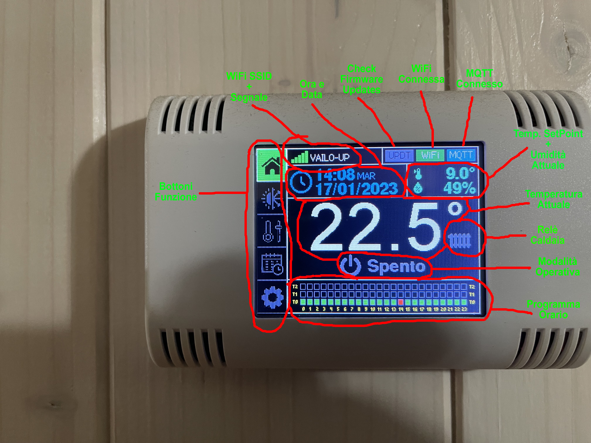
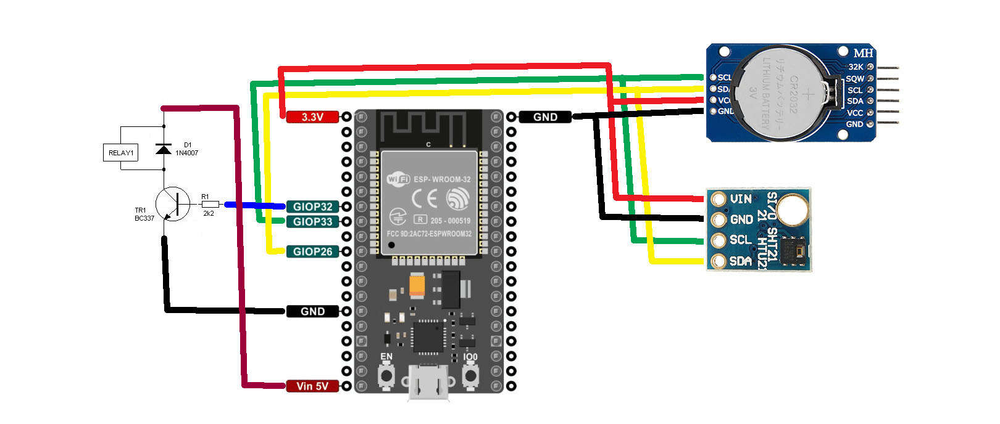

# Introduzione
A complete standalone chrono-thermostat able to communicate via MQTT over WiFi

Questo progetto nasce dalla necessità di avere un termostato per casa non solo capace di poter accendere e spegnere la caldaia al raggiungimento di una  temperatura impostabile, ma anche di poter gestire le varie temperatune nelle varie fasce orarie, giorno per giorno.
In aggiunta quindi alla possibilità di eseguire una programmazione settimanale, questo termostato ha la poossibilità di definire un programma "Holiday" giornaliero da utilizzare in giornate particolari come ferie, festività o altro, dove si è a casa per esempio in settimana e la normale programmazione settimanale non prevede ad esempio la presenza in casa di nessuno.
In aggiunta questo termostato permette di essere configurato con la propria WiFi di casa tramite WPA, e di agganciarsi ad un server MQTT per poter pubblicare il completo stato del termostato e di poter esssere comandato via comandi MQTT da remoto, ad esempio per poter essere integrato su HomeAssistant, come ho fatto io.

Il termostato è basato su un ESP32 inserito in un kit venduto dalla AZ-Delivery che comprende:
- un contenitore predisposto per il fissagigo a muro o su scatole 503
- un circuito stampato in cui è presente uno stadio di alimentazione con ingresso 9..24V, un cicalino pilotabile, la connessione al display ed un'area di prototipazione millefori
- un display da 2.2" o da 2.8" (si può scegliere tra una di queste due dimensioni per il display), il mio progetto è basato sul display da 2.8" anche per una questione di dimensioni del contenitore e di quello che ci va aggiunto per utilizzare la soluzione come termostato

Il materiale aggiuntivo è un relè miniatura da 5V con contatti N.O.
Un transistor BC.537 o un NPN equivalente
Una resistenza da 2.2 Kohm per connettere la base del transistor ad un GPIO dell'ESP32
Un real-time clock su una break-board DS.3231 con protocollo I2C
Un sensore di temperatura/umindità Si7021 su break-board con protocollo I2C

Il display presente nel kit è un ILI.9341 con touch resistivo, con una risoluzione di 320x200 ed interfaccia SPI e viene pilotato tramite la libreria Arduino TFT_eSPI, una tra le più veloci e performanti per micro-controllori ESP.

# Schema Elettrico
Qui sotto uno schema elettrico dei collegamenti dei componenti aggiuntivi da me aggiunti, in quanto lo schema dei collegamenti del display e del cicalino è presente nella documentazione PDF del kit AZ-Delivery.

# Materiale e riferimenti
Qui sotto alcuni links al materiale che ho utilizzato. Non sono per nulla affiliato ai fornitori di questi materiali, li ho inseriti solamente come riferimento per gli oggetti che ho personalmente utilizzato e per tutti quelli che non hanno voglia di cercare i componenti:

- [Kit Contenitore+Display](https://amzn.eu/d/6OSxUhz)
- [BreakBoard DS.3231](https://amzn.eu/d/7noOq9g)
- [BreakBoard Si.7021](https://amzn.eu/d/eylJAoo)
- [Relè 5V SPST miniatura](https://it.rs-online.com/web/p/rele-di-segnale/8154893)
- Resistenza 2,2Kohm 1/4 watt 5%
- Transistor NPN tipo BC.337/BC.537 o similari

# Compilazione
Nella cartella **firmware** sono presenti i files da compilare tramite Arduino IDE.
Per una corretta compilazione, occore importare nella libreria TFT_eSPI il file di customizzazione del pin-out del display, presente nella cartella **TFT_eSPI\User_Setups** e selezionarlo dalla libreria.
All'interno del sorgente firmware, è presente uuna sezione di cofnigurazione, in cui è possibile pre-configurare i defaults, come ad esempio le temperature pre-impostate, il crono-programma, la URL di default a cui puntare per controllare gli aggiornamenti firmware ed il topic MQTT utilizzato per la pubblicazione dei dati.

Il firmware in automatico ricava il Mac-Address dell'ESP32 e lo utilizza per identificarsi sulla rete e sui topics MQTT con un ID univoco, in modo che se sono presenti più termostati, ogniuno abbia un identificativo univoco (un po come avviene anche con gli Shelly o altri prodotti basati si ESP).

La prima compilazione deve avvenire collegando l'ESP-32 tramite cavo USB al PC, mentre i successivi aggiornamenti possono essere fatti via OTA-HTTP senza dover smontare ogni volta il termostato.

# Aggiornamenti firmware
Il firmware ricerca per default un file di testo dal nome "**MQTT-THERMOSTAT.version**" su un webserver configurabile all'interno del firmware. Tale file conterrà il numero di versione del firmware disponibile (formato **x.xx**). Se tale versione risulta essere superiore a quella caricata all'interno del termostato, verrà scaricato il nuovo firmware dal webserver, che dovrà avere come formato del nome file "**MQTT-THERMOSTAT_x.xx.bin**".
Nel caso il file non venga trovato, il termostato segnalerà l'errore di aggiornamento e proseguira con le sue normali funzionalità di termostato senza bloccarsi.
Il check viene fatto in maniera silente dal termostato ogni 10 minuti (viene segnalato dall'icona in alto a sinistra "**UPDT**" che si illumina durante il check); nel caso venga trovato un aggiornamento, compare sulle schermo un popup che indica la versione firmware corrente e quella trovata, ed una barra percentuale che segnala l'avanzamento del download. Al termine dell'aggiornamento, il termostato si riavierà automaticamente con la nuova versione di firmware.
**Ricordarsi all'interno del sorgente di aggiornare la versione di firmware, prima di compilarlo, in quanto la variabile di versione viene utilizzata per confrontarla con la versione trovata sul server web per determinare se ci sono aggiornamenti, e di conseguente, aggiornare anche il file "**MQTT-THERMOSTAT.version**" con lo stesso numero di versione.**
Il nuovo firmware può essere compilato dal menu "**Sketch --> Export compiled binary**", che produrrà sul disco del PC il nuovo firmware, che andrà rinominato nel formato "MQTT-THERMOSTAT_**x.xx.bin**" ovvero con il numero di versione all'interno del nome file.
